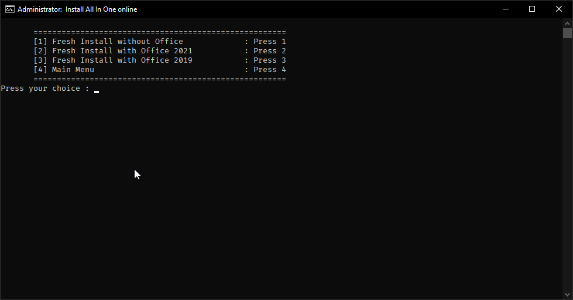
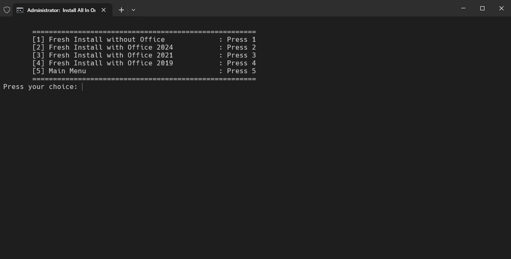
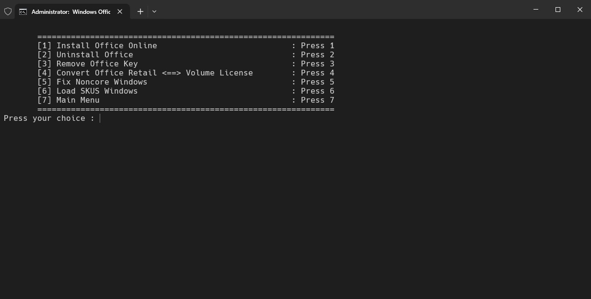
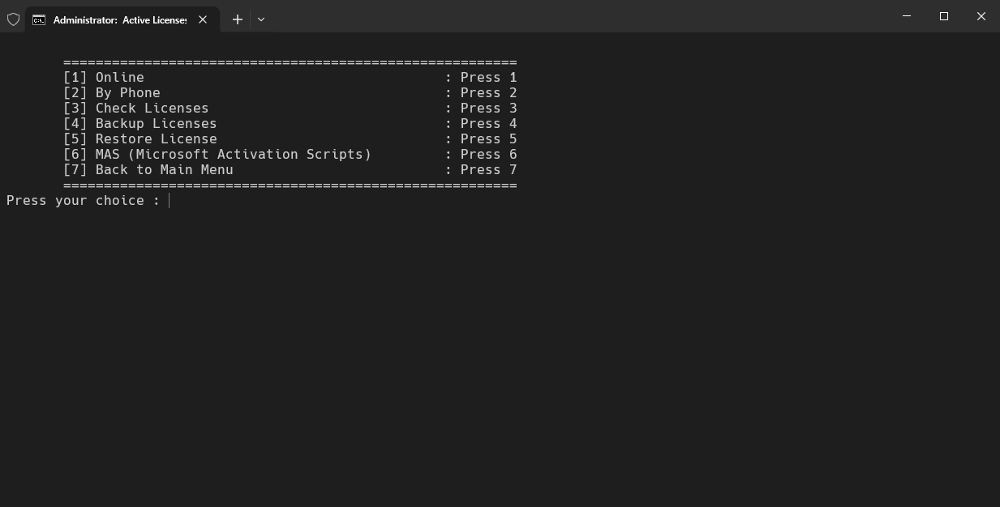
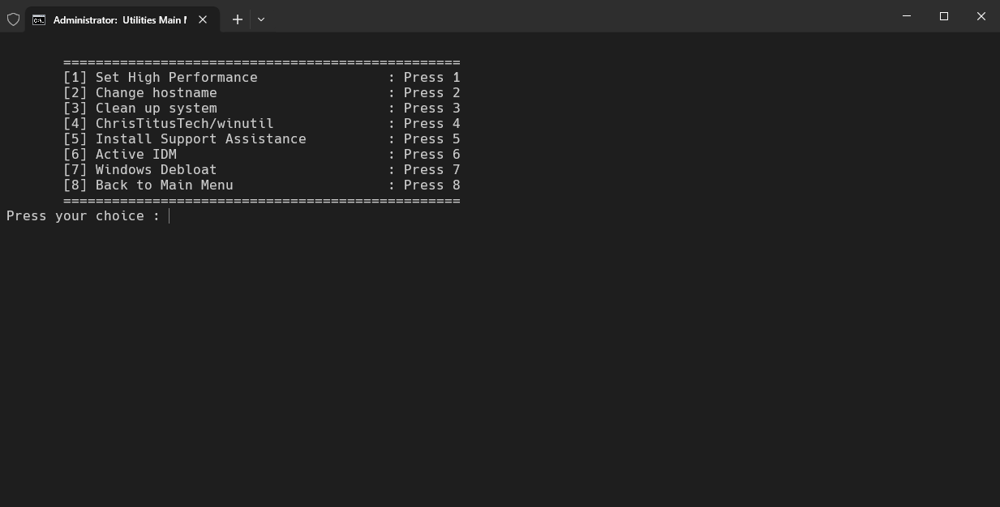
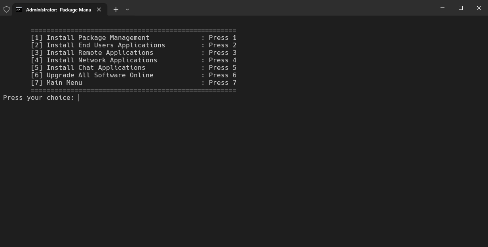
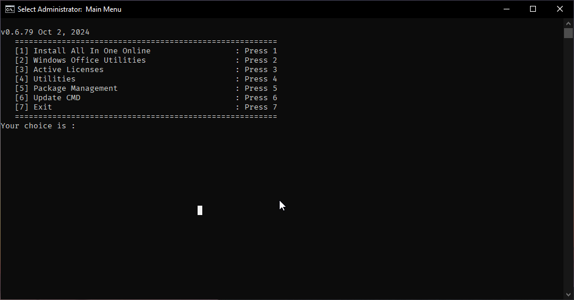

<h1 align="center">🚀 Helpdesk Tool</h1>
<p align="center">
  <a href="https://github.com/tamld/cmdToolForHelpdesk/blob/main/LICENSE"></a>
  <a href="https://github.com/tamld/cmdToolForHelpdesk/issues"></a>
  <a href="https://github.com/tamld/cmdToolForHelpdesk/stargazers"></a>
</p>

[Xem bằng tiếng Việt](README.md)

---

## 📖 Table of Contents
- [🔹 Introduction](#-introduction)
- [⚙️ Key Features](#️-key-features)
- [📌 Interface](#-interface)
- [📌 Usage Guide](#-usage-guide)
- [📜 License](#-license)
- [💡 Contribution & Development](#-contribution--development)
- [🔗 Resources](#-resources)

---

## 🔹 Introduction

**Helpdesk Tool** is an IT support utility designed to automate software installation, resolve system errors, and optimize Windows.

**Main Goals**:
- Reduce troubleshooting time for IT technicians.
- Automate software installation via **Chocolatey & Winget**.
- Fix Windows and Office errors, and manage activations.

📌 **Important Note**:
- Some features are still under development. If you encounter bugs, please report them on [GitHub Issues](https://github.com/tamld/cmdToolForHelpdesk/issues).
- It is recommended to test the script in a **virtual machine** first to avoid system issues.

---

## ⚙️ Key Features

| Feature | Description |
|---|---|
| **📦 Software Installation** | Automatically install Chrome, Unikey, TeamViewer, etc. |
| **🔄 Windows Repair** | Fix update errors, clear cache, optimize the registry. |
| **🖥️ Office Management** | Uninstall, switch versions, fix activation issues. |
| **🔑 Windows & Office Activation** | Check, back up, and restore license keys. |
| **💾 System Cleanup** | Delete junk files and optimize performance. |
| **🔌 Windows Customization** | Adjust Power Plan, change hostname, disable unnecessary services. |
| **📂 Package Management** | Supports installing & updating software with `Chocolatey` & `Winget`. |

---

## 📌 Interface

Below is the main interface and some key features:

- **Helpdesk Tool Main Menu**
  

- **AIO (All-in-One) Software Installation Options**
  

- **Windows & Office Management Tools**
  

- **Windows & Office Activation**
  

- **System Utilities**
  

- **Package Management (Winget & Chocolatey)**
  

---

## 📌 Usage Guide

### 1. **Run Offline or from CMD**

**Method 1: Download the Repo and run the CMD file offline**


**Method 2: Run directly from the command line**
```cmd
cd /d %temp% && curl -fsSL -o helpdesk-tools.cmd https://tinyurl.com/tamld-cmd && start helpdesk-tools.cmd
```

### 2. **Select a function:**
- Enter the number corresponding to the function (1, 2, 3...).
- Follow the on-screen instructions.

### 3. **Update the script (if needed)**

### 4. **Automated Software Installation**

| Mode | Applications Installed | Menu Option |
|---|---|---|
| **📦 All** | Installs all software automatically | **1** |
| **🌐 Basic** | Chrome, 7-Zip, Unikey, Foxit PDF | **5-2** |
| **🛠 IT Support** | Zalo, Facebook Messenger, Telegram | **5-3** |
| **🖥️ Network Tools** | Xpipe, Rclone, OpenSSH, MobaXterm, Putty | **5-4** |
| **💬 Chat Tools** | Microsoft Office, Teams, Zoom | **5-5** |
| **🔄 Upgrade All** | Automatically updates packages managed by Winget or Chocolatey | **5-6** |

---

## 📜 License
This project is licensed under the **MIT License** - see the [LICENSE](LICENSE) file for details.

## 💡 Contribution & Development
We welcome all contributions from the community! 🚀

You can:
- 📌 **Fork the project** and develop new features.
- 🔧 **Edit and optimize the source code** to improve performance.
- 🛠 **Submit a Pull Request (PR) on GitHub** with your improvements.
- 🐞 **Report bugs & suggest new features** in [GitHub Issues](https://github.com/tamld/cmdToolForHelpdesk/issues).

📌 **How to contribute**:
1. **Fork this repo** by clicking the "Fork" button on GitHub.
2. **Clone the repo to your machine**:
   ```cmd
   git clone https://github.com/tamld/cmdToolForHelpdesk.git
   ```

---

## 🔗 Resources

- [📦 Chocolatey - Package Manager](https://chocolatey.org/)
- [🛠 Winget CLI - Microsoft Official](https://github.com/microsoft/winget-cli)
- [📖 Microsoft Docs - Windows Administration](https://docs.microsoft.com/en-us/windows/)
