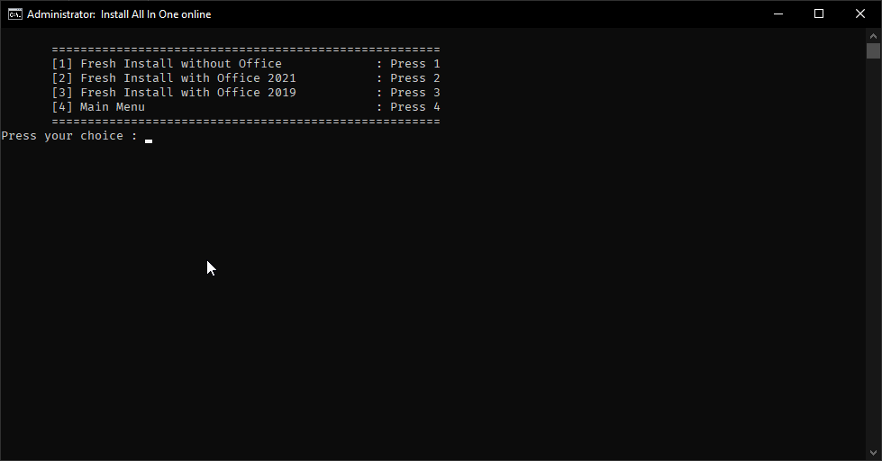
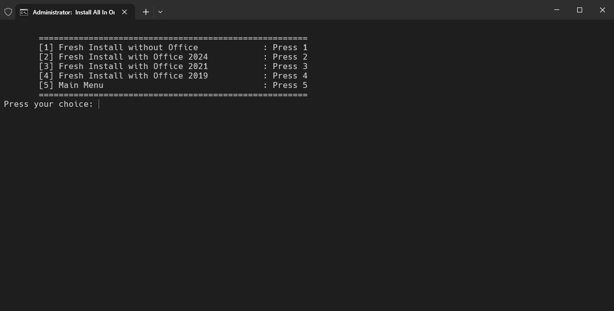
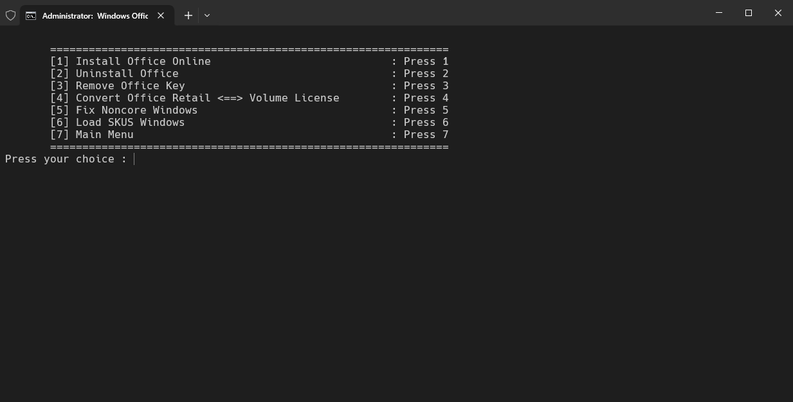
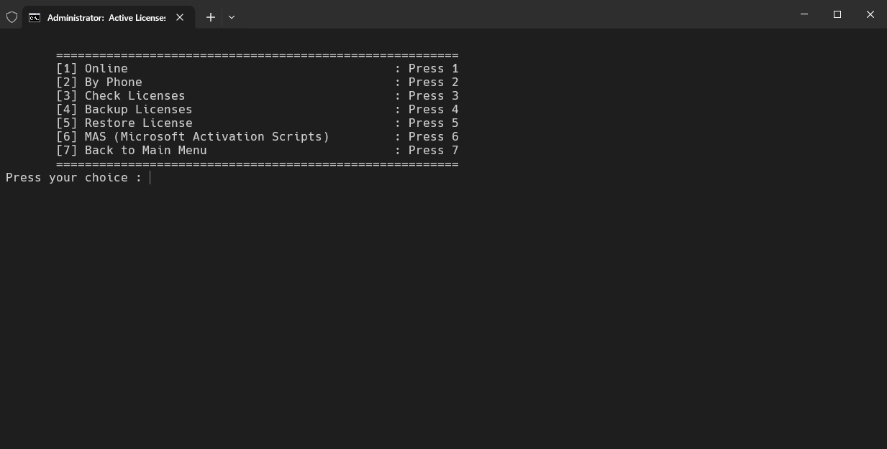
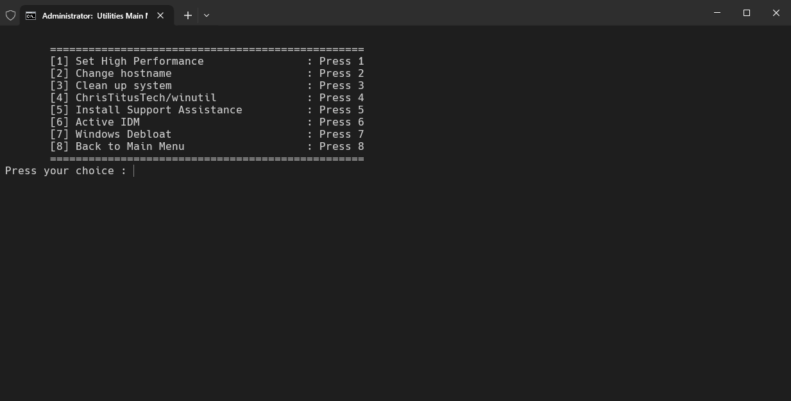
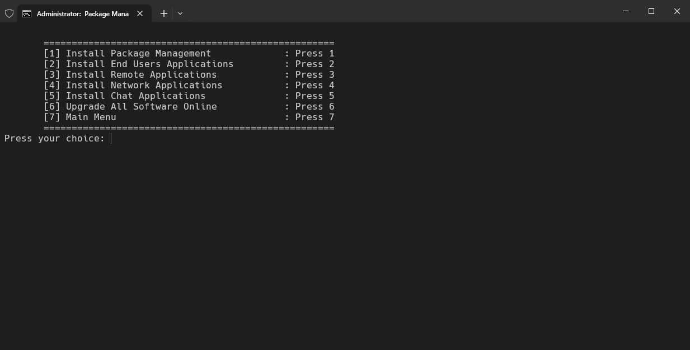

<h1 align="center">🚀 Helpdesk Tool - Công cụ hỗ trợ IT</h1>

  
  
  

  
  
  

**Tác giả:** [tamld](https://github.com/tamld)  
**Yêu cầu:** Windows 10 (1809+) & kết nối internet  

---

## 📖 Mục lục
- [📖 Mục lục](#-mục-lục)
- [🔹 Giới thiệu](#-giới-thiệu)
- [⚙ Chức năng chính](#-chức-năng-chính)
- [📌 Giao diện](#-giao-diện)
- [📌 Hướng dẫn sử dụng](#-hướng-dẫn-sử-dụng)
  - [1. **Chạy script với quyền Administrator**](#1-chạy-script-với-quyền-administrator)
  - [2. **Chọn chức năng cần thực hiện:**](#2-chọn-chức-năng-cần-thực-hiện)
  - [3. **Cập nhật script (nếu cần)**](#3-cập-nhật-script-nếu-cần)
  - [4. **Cài đặt phần mềm tự động**](#4-cài-đặt-phần-mềm-tự-động)

---

## 🔹 Giới thiệu

**Helpdesk Tool** là công cụ hỗ trợ IT, giúp tự động hóa cài đặt phần mềm, xử lý lỗi hệ thống và tối ưu Windows.  
**Mục tiêu chính**:
✔ Giảm thời gian xử lý lỗi cho kỹ thuật viên IT.  
✔ Cài đặt phần mềm tự động qua **Chocolatey & Winget**.  
✔ Khắc phục lỗi Windows, Office, kích hoạt bản quyền.  

📌 **Lưu ý quan trọng**:
- Một số chức năng vẫn đang phát triển. Nếu gặp lỗi, hãy báo cáo tại [GitHub Issues](https://github.com/tamld/cmdToolForHelpdesk/issues).
- Trước khi chạy, nên thử trên **máy ảo** để tránh lỗi hệ thống.

---

## ⚙ Chức năng chính

| Chức năng | Mô tả |
|-----------|-------|
| **📦 Cài đặt phần mềm** | Tự động cài đặt Chrome, Unikey, TeamViewer... |
| **🔄 Sửa lỗi Windows** | Khắc phục lỗi update, xóa cache, tối ưu registry |
| **🖥️ Quản lý Office** | Gỡ cài đặt, chuyển đổi phiên bản, sửa lỗi kích hoạt |
| **🔑 Kích hoạt Windows & Office** | Kiểm tra, sao lưu, phục hồi key bản quyền |
| **💾 Dọn dẹp hệ thống** | Xóa file rác, tối ưu hiệu suất |
| **🔌 Tùy chỉnh Windows** | Chỉnh Power Plan, đổi hostname, disable service thừa |
| **📂 Quản lý package** | Hỗ trợ cài đặt & cập nhật phần mềm bằng `Chocolatey` & `Winget` |

---
## 📌 Giao diện

## 📌 Hướng dẫn sử dụng

### 1. **Chạy script với quyền Administrator**  

### 2. **Chọn chức năng cần thực hiện:**
+ Nhập số tương ứng với chức năng (1, 2, 3...).
+ Làm theo hướng dẫn hiển thị trên màn hình.

### 3. **Cập nhật script (nếu cần)**

### 4. **Cài đặt phần mềm tự động**
Có thể chọn cài đặt theo từng nhóm phần mềm hoặc tất cả cùng lúc:

|**Chế độ**|Ứng dụng được cài|Menu|
|-----------|-------|-------|
|**Tất cả**|Cài toàn bộ phần mềm tự động|**1**|
|**Cơ bản**|Chrome, 7-Zip, Unikey, Foxit PDF|**5-2**|
|**Hỗ trợ IT**|Zalo, Facebook Messenger, Telegram|**5-3**|
|**Tools Network**|Xpipe, Rclone, OpenSSH, mobaxterm,Putty|**5-4**|
|**Công cụ chat**|Microsoft Office, Teams, Zoom|**5-5**|
|**Upgrade all**| Tự động cập nhật danh sách quản lí bằng Winget hoặc chocolatey |**5-6**|

---

🔗 Nguồn tài nguyên tham khảo:
Chocolatey
Winget CLI
Microsoft Docs