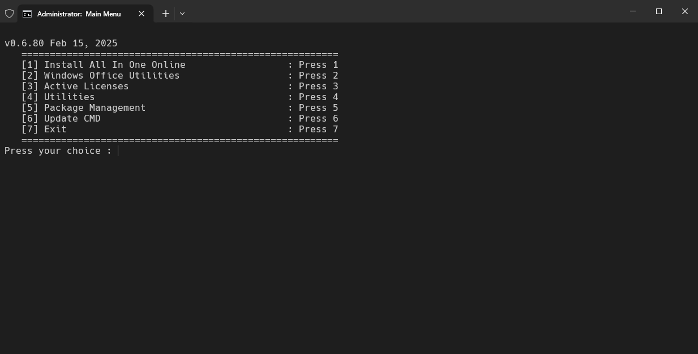

<h1 align="center">🚀 Helpdesk Tool - Công cụ hỗ trợ IT</h1>
<p align="center">
  
  
  
</p>
<p align="center">
  
  
  
</p>

**Tác giả:** [tamld](https://github.com/tamld)  
**Yêu cầu:** Windows 10 (1809+) & kết nối internet  

---

## 📖 Mục lục
- [📖 Mục lục](#-mục-lục)
- [🔹 Giới thiệu](#-giới-thiệu)
- [⚙ Chức năng chính](#-chức-năng-chính)
- [📌 Giao diện](#-giao-diện)
- [📌 Hướng dẫn sử dụng](#-hướng-dẫn-sử-dụng)
  - [1. **Chạy script với quyền Administrator**](#1-chạy-script-với-quyền-administrator)
  - [2. **Chọn chức năng cần thực hiện:**](#2-chọn-chức-năng-cần-thực-hiện)
  - [3. **Cập nhật script (nếu cần)**](#3-cập-nhật-script-nếu-cần)
  - [4. **Cài đặt phần mềm tự động**](#4-cài-đặt-phần-mềm-tự-động)
- [📜 Giấy phép](#-giấy-phép)
- [💡 Đóng góp \& Phát triển](#-đóng-góp--phát-triển)
- [🔗 Nguồn tài nguyên tham khảo](#-nguồn-tài-nguyên-tham-khảo)

---

## 🔹 Giới thiệu

**Helpdesk Tool** là công cụ hỗ trợ IT, giúp tự động hóa cài đặt phần mềm, xử lý lỗi hệ thống và tối ưu Windows.  
**Mục tiêu chính**:
✔ Giảm thời gian xử lý lỗi cho kỹ thuật viên IT.  
✔ Cài đặt phần mềm tự động qua **Chocolatey & Winget**.  
✔ Khắc phục lỗi Windows, Office, kích hoạt bản quyền.  

📌 **Lưu ý quan trọng**:
- Một số chức năng vẫn đang phát triển. Nếu gặp lỗi, hãy báo cáo tại [GitHub Issues](https://github.com/tamld/cmdToolForHelpdesk/issues).
- Trước khi chạy, nên thử trên **máy ảo** để tránh lỗi hệ thống.

---

## ⚙ Chức năng chính

| Chức năng | Mô tả |
|-----------|-------|
| **📦 Cài đặt phần mềm** | Tự động cài đặt Chrome, Unikey, TeamViewer... |
| **🔄 Sửa lỗi Windows** | Khắc phục lỗi update, xóa cache, tối ưu registry |
| **🖥️ Quản lý Office** | Gỡ cài đặt, chuyển đổi phiên bản, sửa lỗi kích hoạt |
| **🔑 Kích hoạt Windows & Office** | Kiểm tra, sao lưu, phục hồi key bản quyền |
| **💾 Dọn dẹp hệ thống** | Xóa file rác, tối ưu hiệu suất |
| **🔌 Tùy chỉnh Windows** | Chỉnh Power Plan, đổi hostname, disable service thừa |
| **📂 Quản lý package** | Hỗ trợ cài đặt & cập nhật phần mềm bằng `Chocolatey` & `Winget` |

---
## 📌 Giao diện

Dưới đây là giao diện chính và một số tính năng quan trọng:

- **Menu chính của Helpdesk Tool**
  

- **Tùy chọn cài đặt phần mềm AIO (All-in-One)**
  

- **Công cụ quản lý Windows & Office**
  

- **Kích hoạt Windows & Office**
  

- **Các tiện ích hệ thống**
  

- **Quản lý Package (Winget & Chocolatey)**
  


## 📌 Hướng dẫn sử dụng


### 1. **Chạy script với quyền Administrator**  

### 2. **Chọn chức năng cần thực hiện:**
+ Nhập số tương ứng với chức năng (1, 2, 3...).
+ Làm theo hướng dẫn hiển thị trên màn hình.

### 3. **Cập nhật script (nếu cần)**

### 4. **Cài đặt phần mềm tự động**
Có thể chọn cài đặt theo từng nhóm phần mềm hoặc tất cả cùng lúc:


|**Chế độ**|Ứng dụng được cài|Menu|
|-----------|-------|-------|
|**📦 Tất cả**|Cài toàn bộ phần mềm tự động|**1**|
|**🌐 Cơ bảnn**|Chrome, 7-Zip, Unikey, Foxit PDF|**5-2**|
|**🛠 Hỗ trợ IT**|Zalo, Facebook Messenger, Telegram|**5-3**|
|**🖥 Tools Network**|Xpipe, Rclone, OpenSSH, mobaxterm,Putty|**5-4**|
|**💬 Công cụ chat**|Microsoft Office, Teams, Zoom|**5-5**|
|**🔄 Upgrade all**| Tự động cập nhật danh sách quản lí bằng Winget hoặc chocolatey |**5-6**|

---

## 📜 Giấy phép
Dự án này được cấp phép theo **MIT License** - xem chi tiết tại [LICENSE](LICENSE).

## 💡 Đóng góp & Phát triển
Chúng tôi hoan nghênh mọi đóng góp từ cộng đồng! 🚀  

Bạn có thể:
- 📌 **Fork dự án** và phát triển thêm tính năng mới.
- 🔧 **Chỉnh sửa và tối ưu mã nguồn** để cải thiện hiệu suất.
- 🛠 **Gửi Pull Request (PR) trên GitHub** nếu bạn có cải tiến.
- 🐞 **Báo lỗi & đề xuất tính năng mới** trong [GitHub Issues](https://github.com/tamld/cmdToolForHelpdesk/issues).

📌 **Cách tham gia**:
1. **Fork repo này** bằng cách nhấn nút "Fork" trên GitHub.
2. **Clone repo về máy**:
```cmd
git clone https://github.com/tamld/cmdToolForHelpdesk.git
```

## 🔗 Nguồn tài nguyên tham khảo

- [📦 Chocolatey - Package Manager](https://chocolatey.org/)
- [🛠 Winget CLI - Microsoft Official](https://github.com/microsoft/winget-cli)
- [📖 Microsoft Docs - Windows Administration](https://docs.microsoft.com/en-us/windows/)